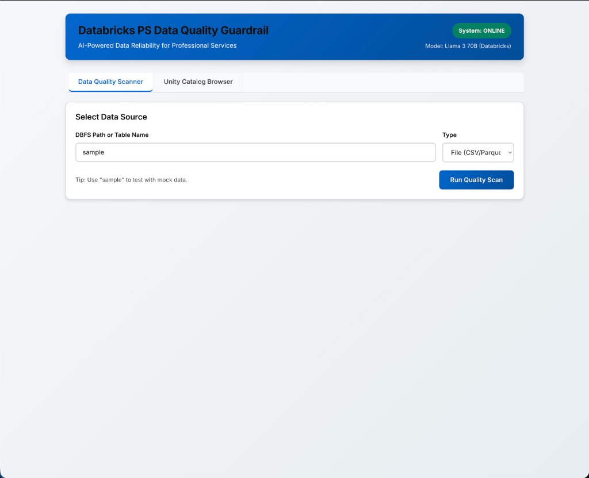
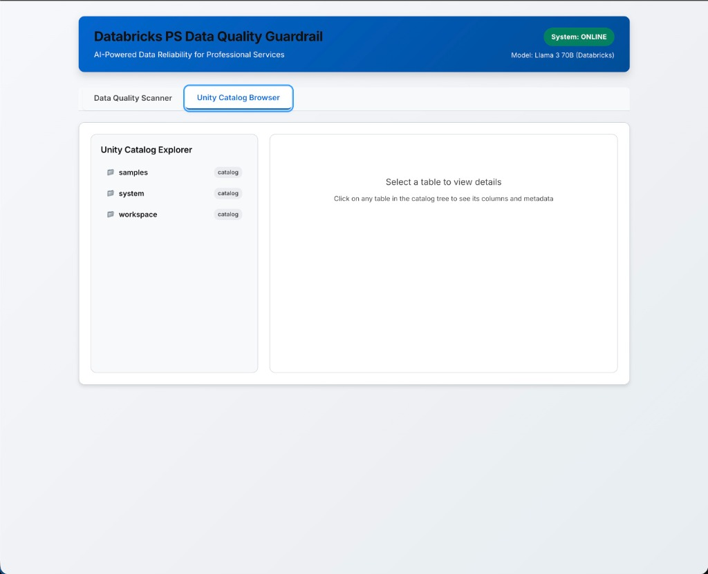
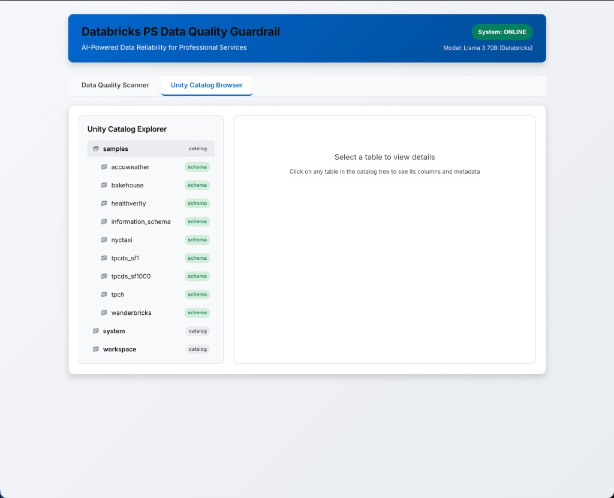
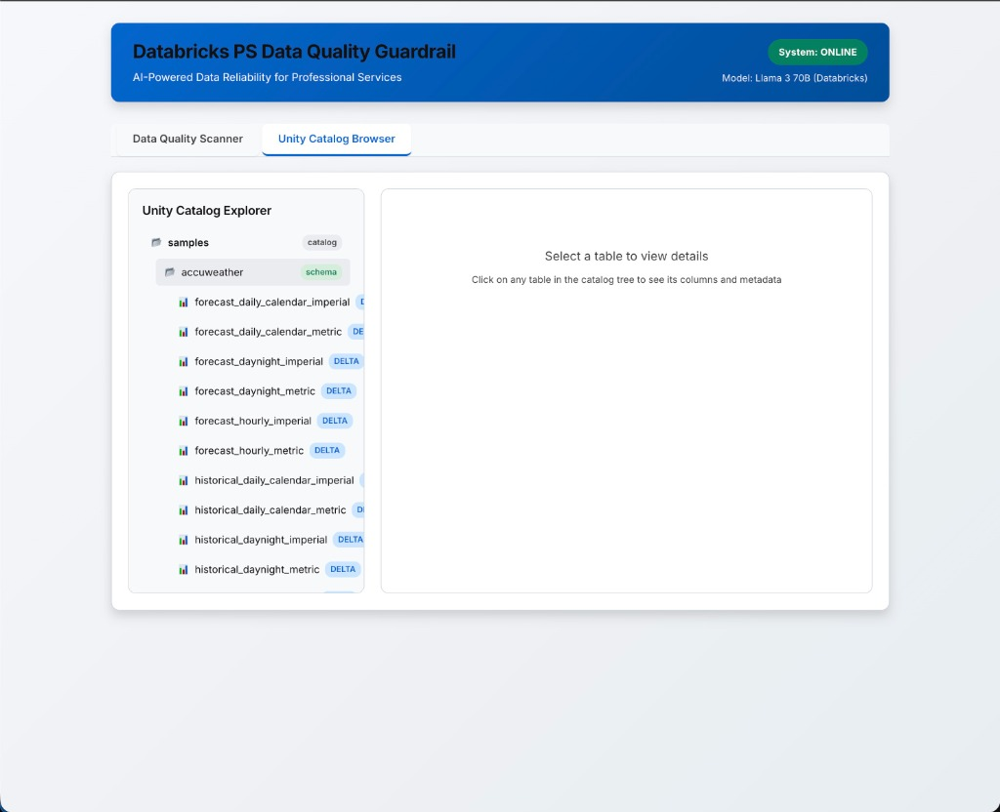
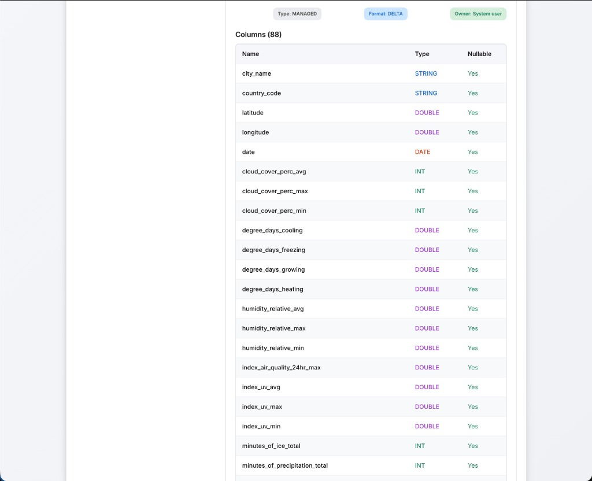
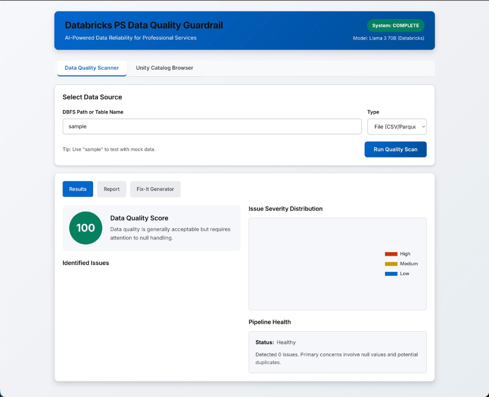
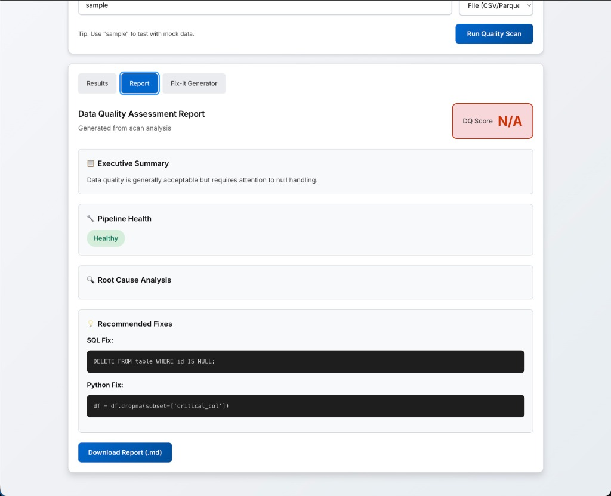

# Databricks PS AI Data Quality Guardrail

<div align="center">

**AI-Powered Data Reliability for Professional Services**

[](https://python.org)
[](https://fastapi.tiangolo.com)
[](https://reactjs.org)
[](https://databricks.com)

</div>

---

## 📋 Overview

**Databricks PS Data Quality Guardrail** is a production-ready web application that enables Databricks Professional Services teams to rapidly assess data quality across customer environments. It connects directly to Unity Catalog, analyzes tables for common data issues, and uses AI to generate actionable remediation recommendations.

### The Problem It Solves

Professional Services engineers often encounter data quality issues during customer engagements—null values, duplicates, schema drift, and distribution anomalies that can derail migrations, ETL implementations, and analytics projects. Traditionally, diagnosing these issues requires:

- Manual SQL queries to inspect tables
- Custom Python scripts for statistical analysis
- Time-consuming root cause investigation
- Hand-crafted remediation notebooks

**This tool automates the entire workflow**, allowing PS teams to:
- ✅ Scan any Unity Catalog table in seconds
- ✅ Get AI-powered root cause analysis
- ✅ Generate ready-to-run Fix-It notebooks
- ✅ Produce professional reports for customer handoff

---

## 🖥️ Application Screenshots

### Data Quality Scanner
The main interface for running data quality scans. Enter a table path or use "sample" for demo mode.



*The scanner supports both DBFS file paths and Unity Catalog table names. The system status indicator shows real-time connection to Databricks and the active AI model.*

---

### Unity Catalog Browser
Browse your Databricks Unity Catalog directly from the application. The hierarchical tree view shows all catalogs, schemas, and tables you have access to.



*Real-time integration with Unity Catalog via REST API. The browser fetches catalog metadata directly from your Databricks workspace.*

---

### Schema Explorer
Expand catalogs to view all available schemas. Color-coded badges help identify schema types at a glance.



*The samples catalog includes various demo datasets perfect for testing—nyctaxi, tpch, accuweather, and more.*

---

### Table Browser with Delta Tables
Navigate through schemas to view individual tables. Delta tables are highlighted with blue badges for easy identification.



*Click on any table to view its schema details and trigger a data quality scan.*

---

### Table Schema Details
View comprehensive table metadata including column names, data types, and nullability. One-click scanning of any table.



*Displays table type (MANAGED/EXTERNAL), format (DELTA), owner, and complete column schema with 88 columns shown for this AccuWeather forecast table.*

---

### Scan Results Dashboard
Immediate feedback on data quality with a calculated DQ Score (0-100), issue severity distribution, and identified anomalies.



*Visualizes the health of your data at a glance. The severity chart helps prioritize which issues need immediate attention.*

---

### AI Assessment Report
A comprehensive, auto-generated report that explains *why* issues occurred and *how* to fix them.



*Includes an executive summary, pipeline health status, root cause analysis, and copy-pasteable SQL/Python code snippets for remediation.*

---

## 🏗️ Tech Stack

### Backend
| Technology | Purpose |
|------------|---------|
| **FastAPI** | High-performance async Python web framework |
| **Pandas** | Data analysis and quality checks |
| **Databricks REST API** | Unity Catalog integration, SQL Statement Execution |
| **Python 3.9+** | Core runtime |

### Frontend
| Technology | Purpose |
|------------|---------|
| **React 18** | Component-based UI (via ESM, no build step) |
| **HTM** | JSX alternative for browser-native React |
| **Chart.js** | Data visualization (severity distribution charts) |
| **Vanilla CSS** | Modern, responsive styling |

### Databricks Integrations
| Integration | Description |
|-------------|-------------|
| **Unity Catalog** | Browse catalogs, schemas, and tables via REST API |
| **SQL Statement Execution API** | Query tables directly through Serverless SQL Warehouse |
| **Foundation Models** | AI analysis via Llama 3 70B (with fallback to heuristic mode) |
| **Workspace API** | Upload Fix-It notebooks directly to Databricks |

---

## ⚙️ Features

### 🔍 Data Quality Scanning
- **Null Analysis**: Detects high null percentages per column
- **Duplicate Detection**: Identifies duplicate rows
- **Schema Analysis**: Inspects column types and distributions
- **DQ Score**: Computes an overall quality score (0-100)

### 🤖 AI-Powered Analysis
- **Root Cause Analysis**: Explains why issues exist
- **Pipeline Health Assessment**: Evaluates data pipeline reliability
- **Recommended Fixes**: SQL and Python remediation code
- **Delta Optimizations**: Suggests OPTIMIZE and VACUUM operations

### 📊 Report Generation
- Professional Markdown reports
- Executive summaries for stakeholders
- Detailed issue breakdowns with severity levels
- Downloadable for customer handoff

### 🛠️ Fix-It Notebook Generator
- Auto-generates Databricks notebooks (.py format)
- Includes SQL fixes, Python fixes, and Delta optimizations
- One-click upload to Databricks workspace

---

## 🚀 Quick Start

### Prerequisites
- Python 3.9+
- A Databricks Workspace with Unity Catalog
- SQL Warehouse (Serverless recommended)

### Installation

1. **Clone the repository**
   ```bash
   git clone https://github.com/michaelromero212/Databricks-PS-AI-Data-Quality-Guardrail.git
   cd Databricks-PS-AI-Data-Quality-Guardrail
   ```

2. **Install dependencies**
   ```bash
   cd backend
   pip install -r requirements.txt
   ```

3. **Configure environment**
   ```bash
   cp sample_config.env .env
   # Edit .env with your Databricks credentials:
   # - DATABRICKS_HOST=https://your-workspace.cloud.databricks.com
   # - DATABRICKS_TOKEN=your-access-token
   # - DATABRICKS_WAREHOUSE_ID=your-sql-warehouse-id
   ```

4. **Run the application**
   ```bash
   cd ..
   ./start.sh
   ```

5. **Open in browser**
   Navigate to [http://localhost:8000](http://localhost:8000)

---

## 📁 Project Structure

```
├── backend/
│   ├── app.py              # FastAPI application & routes
│   ├── dbx_cli.py          # Databricks REST API integrations
│   ├── dq_checks.py        # Data quality analysis logic
│   ├── ai_analyzer.py      # AI/LLM integration
│   ├── fixit_generator.py  # Notebook generation
│   ├── report_generator.py # Markdown report generation
│   └── requirements.txt    # Python dependencies
├── frontend/
│   ├── index.html          # Entry point
│   ├── app.js              # Main React application
│   ├── styles.css          # Application styles
│   └── components/         # React components
│       ├── DataSelector.js
│       ├── DataQualityResults.js
│       ├── ReportCard.js
│       ├── FixItPatchUI.js
│       └── CatalogBrowser.js
├── outputs/                # Generated reports
├── notebooks/              # Generated Fix-It notebooks
├── docs/images/            # Documentation screenshots
└── start.sh               # Launch script
```

---

## 🔧 Configuration

### Environment Variables

| Variable | Description | Required |
|----------|-------------|----------|
| `DATABRICKS_HOST` | Your workspace URL (e.g., `https://xxx.cloud.databricks.com`) | Yes |
| `DATABRICKS_TOKEN` | Personal Access Token | Yes |
| `DATABRICKS_WAREHOUSE_ID` | SQL Warehouse ID for queries | Yes |
| `DATABRICKS_SERVING_ENDPOINT` | AI model endpoint (default: `databricks-meta-llama-3-70b-instruct`) | No |

### Getting Your Warehouse ID

1. Go to your Databricks workspace
2. Navigate to **SQL** → **SQL Warehouses**
3. Click on your warehouse
4. Copy the ID from the URL or warehouse details

---

## 🎯 Usage Workflow

1. **Browse Catalog** → Navigate Unity Catalog to find your target table
2. **Scan Table** → Click "Scan This Table for Data Quality Issues"
3. **Review Results** → Examine DQ score, issues, and severity distribution
4. **View Report** → Check AI analysis with root cause and recommendations
5. **Generate Fix-It** → Create a remediation notebook
6. **Upload to Databricks** → Deploy notebook directly to workspace

---

## 🛡️ Notes for Reviewers

- **AI Model**: The application uses Databricks Foundation Models (Llama 3 70B). If unavailable, it gracefully falls back to heuristic analysis mode.
- **Demo Mode**: Use `sample` as the data path to test with included mock data without Databricks connection.
- **No Build Step**: The React frontend uses ESM imports—no webpack/npm build required.
- **Production Ready**: Error handling, logging, and fallback mechanisms are implemented throughout.

---

## 📄 License

This project is for demonstration and portfolio purposes.

---

<div align="center">
Built with ❤️ for Databricks Professional Services
</div>
